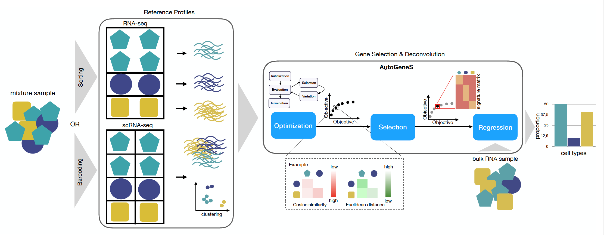

# AutoGeneS

AutoGeneS **automatically** extracts informative genes and reveals the cellular heterogeneity of bulk RNA samples. AutoGeneS requires no prior knowledge about marker genes and selects genes by **simultaneously optimizing multiple criteria**: minimizing the correlation and maximizing the distance between cell types. It can be applied to reference profiles from various sources like single-cell experiments or sorted cell populations.



For a multi-objective optimization problem, there usually exists no single solution that simultaneously optimizes all objectives. In this case, the objective functions are said to be conflicting, and there exists a (possibly infinite) number of **Pareto-optimal solutions**. Pareto-(semi)optimal solutions are a set of all solutions that are not dominated by any other explored solution. Pareto-optimal solutions offer a set of equally good solutions from which to select, depending on the dataset

## Installation

1. PyPI only <br/> 
```pip install autogenes```<br/>

2. Development Version (latest version on github) <br/>
```git clone https://github.com/theislab/AutoGeneS```<br/>
```pip install dist/autogenes-1.0.3-py3-none-any.whl```<br/>

## Example

[Example on pseudo bulks](https://github.com/theislab/AutoGeneS/blob/master/deconv_example/bulkDeconvolution_using_singleCellReferenceProfiles.ipynb)

## Documentation

[Documentation](https://autogenes.readthedocs.io/en/latest/)

[Getting Started](https://autogenes.readthedocs.io/en/latest/getting_started.html)

## Dependencies

* python>=3.6
* pandas>=0.25.1
* anndata>=0.6.22.post1
* numpy>=1.17.2
* dill>=0.3.1.1
* deap>=1.3.0
* scipy>=1.3
* cachetools>=3.1.1
* scikit-learn>=0.21.3
* matplotlib>=3.0

## Citation

[Aliee, Hananeh and Theis, Fabian, AutoGeneS: Automatic gene selection using multi-objective optimization for RNA-seq deconvolution](https://www.biorxiv.org/content/early/2020/02/23/2020.02.21.940650)
